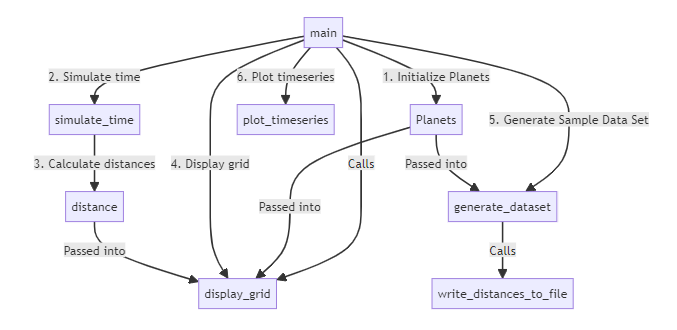

Author: Anthony M. Rodriguez

Student ID#: 1205104

Class: DSC 430 - Python Programming

Date: 01/24/2024

Honor Statement: I have not given or received any unauthorized assistance on this assignment.

Assignment Details:

- Git Repo URL: [DSC 430 - https://github.com/Mrmachine3/DPU-DSC430.git](https://github.com/Mrmachine3/DPU-DSC430.git)

- Video Explanation URL: [Top Down Design Overview of Closest Planet - https://youtu.be/4AfZRKpUYVs](https://youtu.be/4AfZRKpUYVs)

# ***Top Down Design of Closest Planet***

## Assumptions

For this assignment, I've noted the following assumptions:

- The data dictionary is a one-time data set that is used to store the initial parameters of each planet
- The radius of each planet does not include the additional distances accounting for the planet's rings, where applicable
- The initial planet parameters will not be updated as the simulations are underway
- All calculations of the distance assume that planets are perfect 3D spheres, or rather 2D circles, and that any distance calculations reflect points on a perimeter of a circle for simplicity
- The simulation assumed the orbital year was a perfect circle, and some planets in actuality orbit the sun in more of a elliptical orbit
- A user will not need to update the initial simulation period of 1000 years and the use of an earth year to denote the number of days per year of the simulation
- The sample dataset that is created will not need to vary for the selected planets being simulated, i.e. only comparisons between Earth, Mercury, Venus, and Mars are in scope

## Functional Design Requirements

***Planet Class***

The Planet class represents celestial bodies with attributes such as name, radius, and orbital period. It has the following methods:

  - `__init__`:
    - This class method initializes a planet object with a given name, radius, and orbital period.

  - `position`:
    - This class method calculates the coordinates of a point on the outermost perimeter of the planet's orbit for a given day.

**`distance(planet1, planet2, day)` function**:
This function computes the distance between two points on the perimeters of two distinct planets on a specific day.

**`simulate_time(planets, sim_duration)` function**:
This function measures distances between planets over a specified siimulation duration.

**`display_grid(planets, distances)` function**:
This function formats and displays an average distance grid between each pair of planets.

**`write_distances_to_file(earth, other_planets, sim_days, sim_years, filename)` function**:
This function writes the distances of selected planets to a CSV file.

**`generate_dataset(planets, filename, sim_days=1000, sim_years=1)` function**:
This function generates the distances dataset for selected planets using a single default orbital year containing 1000 days.

**`plot_timeseries(filename)` function**:
This function plots the dataset from the input file as a time series graph.

**`main(sim_days, sim_years, filename)` function**:
This function invokes the program's logic which derives a list of all planets in the solar system based on the data dictionary defined. The program subsequently initializes an 8x8 grid matrix of zeros which are updated when invoking the `simulate_time()` function, which updates the 8x8 grid matrix with the average distances between planet pairs. The calling of the `display_grid()` function outputs the 8x8 grid matrix to the terminal as a preview prior to initiating a subsequent simulation that generates a sample data set file containing 1000 days of average distances between Earth and Mercury, Venus, and Mars. Finally, the `plot_timeseries()` function reads the CSV file and outputs a visualization of the sample data set to show a timeseries comparison of data between the different planets.

## Non-Functional Design Requirements (or lack of)

Non-functional elements of the program include:

1. **Performance:** This program may experience performance issues, especially when simulating distances between planets over a large number of days.
2. **Robustness:** Error handling is very limited, and the program may not gracefully handle unexpected inputs or errors during file I/O operations.
3. **Readability:** The code may seem difficult to read and understand, particularly for individuals unfamiliar with the underlying mathematical and astronomical concepts.
4. **Portability:** The program's dependencies on external libraries such as NumPy, pandas, and Matplotlib may affect its portability across different environments.
5. **Usability:** The program lacks a user-friendly interface and may require users to have knowledge of Python programming to interact with it effectively.
6. **Testing:** The program may lack comprehensive unit tests, making it challenging to verify its correctness and reliability under different scenarios.
9. **Security:** The program does not address security concerns such as input validation, making it vulnerable to potential security threats.

### Design Considerations
I decided to create utility functions to clearly modularize more complex sections of the code and simply call the functions within the main function. This helps with source code readability and maintenance over time. In the main program invocation, I've defined a few settings and variables that are subsequently passed into the main function, primarily the duration of orbital years in days, and the number of years to simulate. Finally, I've defined an output filename for the sample data set that will be generated with different simulation duration interval parameters that overwrite the values set at the main program invocation.

Additional design considerations include defining an initial data dictionary containing the planet radii and orbital years, this makes the planet instantiation process a lot faster when doing a list comprehension in the main function.

### Implementation Considerations

- **How is your main function organized?**
  - The `main()` function is organized in a procedural manner whereby the first entrypoint is the `main()` function followed sequentially by the utility functions. For each utility function, the results of the previous functions are passed as parameters to the next function until either a distance grid, a sample dataset, and it's accompanying data visualization is generated in the form of a timeseries graph.

## Appendix

### Program Execution Flow

The procedural flow of the program's execution is as follows:

1. **Initialize Planets:** The `main` function initializes the planets
2. **Simulate Time:** The `simulate_time` function simulates the passage of time to calculate distances between planets
3. **Distances:** The `distance` function calculates the distances between each pair of planets
4. **Display Grid:** The `display_grid` function formats and displays the calculated distances into a 8x8 grid
5. **Generate Data Set:** The `generate_dataset` function generates a sample dataset of distances between planets with parameters of 1000 days
6. **Write Distances to File:** The `write_distances_to_file` function writes the generated distances to a file
7. **Plot Timeseries:** The `plot_timeseries` function reads in the sampled data set and plots a time series graph of the distances between planets over time

### Top Down Design Diagram



### Simulation Data Analysis

1. **Which planet is on average clesest to Earth?**
  - From the data set displayed, Mercury appeared to be the closest to Earth with an average distance of 9.63 million miles.

  - **Did the results match your expectations?**
    - From what I knew about Astronomy, Mercury is currently the planet closest from the sun. However, when developing this program I wasn't sure what to expect at first because I was having trouble understanding the objective of the simulation events until I displayed the 8x8 grid matrix. Once I was able to view the entire data set containing all the total average distances, the results came to match my initial expectation based on what I already knew.

2. **Describe the time-series and discuss them considering your findings in #1.**


  - As observed from the timeseries graph, at day zero the distances between Earth and the different planets don't closely align with the average total distances shown in the display grid; however, at around day 50 the numbers seem to align with the average values shown in the final display grid. The timeseries graph shows sine waves for each distance comparison and over time all distances seem to converge, or align with one another near discernable intervals, such as at days 93, 665. Additionally, Mercury (blue) and Venus (orange) appear to have very similar distances at more frequent intervals over the course of 1000 days, such as at day 97, 167, 415, 486, 679, 750, and day 1000. The distances between Earth to Mars and Mercury also only converged at few intervals, such as at days 91, 651, 813, 818, and 892.

3. **Describe three ways to extend the simulation**
  - The simulation assumed the orbital year was a perfect circle, and some planets orbit the sun in more of a elliptical orbit. The simulation could have accounted for the distances between two planets on either elliptical and/or circular orbits.
  - The simulation assumed only comparisons between Earth, Mercury, Venus, and Mars are in scope, this simulation could have also included a user input interface to allow the user to select which planets would be compared, how many comparisons data sets would be generation, and how large of a sample size per planet pair comparison.
  - Assuming that the planets are perfect spherical objects, this simulation could have also found the distance between two points on one planet in comparison to a single point on another planet to find the relative distance between two points on a single planet, accounting for the planet's surface curvature.
  - Assuming that the planets are perfect spherical objects, this simulation could have also found the total surface area of a tract of land represented by any number of points on a single planet, where the single point on the comparison planet could be used to find all the surface curvature distances between points on the secondary planet, i.e. this approach would be able to accurately calculate the surface area of a segment of land accounting for the curvature of the planet
  - The simulation could also include a calculation for how far a space shuttle might travel from a point on planet A to a fixed target point on planet B accounting for the orbital rotation of the destination planet from the source planet.

### Source Code:

```python
# LIBRARIES
import math
import numpy as np
import pandas as pd
import matplotlib.pyplot as plt

# CLASSES
class Planet():
    """An object that instantiates a Planet object with a radius and the length
        of the planet's year (in days)
    """
    def __init__(self,name,radius, year):
        """A method to initialize the Planet object with a radius and year

        Args:
            name (str): name of the planet
            radius (int): length of the planet's radius beginning
                            from origin point to outermost perimeter
            year (int): the number of days required to orbit the sun
        """
        self.name = name
        self.radius = radius
        self.year = year

    def position(self, day):
        """A method to calculate the coordinates of a point on the
            outermost perimeter of planet

        Args:
            x (int): x coordinate of point on perimeter
            y (int): y coordinate of point on perimeter
        """
        # Calculate the angle in radians as a proportion of days of a year
        radians = math.radians(day/self.year)*360
        
        # Derive the x coordinate with trigonometric function of cosine
        x = math.cos(radians) * self.radius
        # Derive the y coordinate with trigonometric function of sine
        y = math.sin(radians) * self.radius

        return round(x,2),round(y,2)
    
def distance(planet1, planet2, day):
    """Function to measure distance between two points on perimeter of two distinct planets

    Args:
        planet1 (obj): first Planet object
        planet2 (obj): second Planet object
        day (int): the day on each planet from where to measure distance between both planets

    Returns:
        int: number of miles between one point along the perimeter of two different planets
    """
    # Unpack x and y coordinates of planets 1 & 2
    x1,y1 = planet1.position(day)
    x2,y2 = planet2.position(day)

    # Utilize the pythagorean theorem to calculate the length of the hypotenuse
    return math.sqrt((x2 - x1)**2 + (y2 -y1)**2)

def simulate_time(planets, sim_duration):
    """Function to measure distances between planets over n duration

    Args:
        planets (obj): a planet object defining the name, radius, and orbital year
        sim_duration (int): interval of time representing the simulation duration in days

    Returns:
        int: calculated average distance over the simulation duration
    """
    # Initialize variables at zero to incrementally increase after iteration calculations
    total_distance = 0
    total_pairs = 0

    # Iterate over the total days in the simulation
    for day in range(sim_duration):
        # Initialize variables at zero to incrementally increase after daily calculations
        daily_distance = 0
        daily_pairs = 0

        # Iterate over all planets to identify the 1st planet needed for the distance calculation
        for i in range(len(planets)):
            # Iterate over all planets to identify the 2nd planet needed for the distance calculation
            for j in range(i+1, len(planets)):
                # Call distance function and passing in parameters
                d = distance(planets[i], planets[j], day)
                daily_distance += d
                daily_pairs += 1

        # Calculate average daily distances amongst all planet pairs
        avg_daily_distance = daily_distance / daily_pairs
        total_distance += avg_daily_distance
        total_pairs += 1
        
    # Calculate average total distances amongst all planet pairs
    return round((total_distance / total_pairs), 2)

def display_grid(planets, distances):
    """_summary_

    Args:
        planets (list): a list of all instances of planets in solar system
        distances (np.ndarray): an 8x8 matrix of calculated distances between planet pairs

    Returns:
        distances (np.ndarray): an 8x8 matrix of calculated distances between planet pairs
    """
    # Display the distance grid with planet names as row/column headings
    grid = ""
    grid += "Average Distance between each pair of planets:\n"
    headers = "\t".join([planet.name for planet in planets])
    grid += f"\t{headers}"
    for i, row in enumerate(distances):
        grid += f"\n{planets[i].name}\t"
        for distance_val in row:
            grid += f"{distance_val:.2f}\t"

    # A labeled grid with planet names and updated distance values
    return grid

def write_distances_to_file(earth, other_planets, sim_days, sim_years, filename):
    """Function to write the distances of selected planets to a file

    Args:
        earth (obj): an instance of the planet earth
        other_planets (list): a list containing instances of mercury, venus, and mars
        sim_days (int): a number of days representing an orbital year
        sim_years (int): a number of orbital years
        filename (str): the name of the desired output file
    """
    # file context manager to write the distances between planets to rows
    with open(filename, 'w') as file:
        file.write("Mercury,Venus,Mars\n")
        for day in range(sim_days * sim_years):
            mercury_distance = distance(earth, other_planets[0], day)
            venus_distance = distance(earth, other_planets[1], day)
            mars_distance = distance(earth, other_planets[2], day)
            file.write(f"{mercury_distance:.2f},{venus_distance:.2f},{mars_distance:.2f}\n")

def generate_dataset(planets, filename, sim_days=1000, sim_years=1):
    """Function to generate the distances data set for selected planets

    Args:
        planets (list): a list containing instances of all planets
        sim_days (int, optional): a number of days representing an orbital year
        sim_years (int, optional): a number of orbital years
        filename (str): the name of the desired output file
    """
    # Defining variables for select planets
    earth = planets[2]
    other_planets = [planets[0], planets[1], planets[3]]

    # Call function to write distance data to a file
    write_distances_to_file(earth, other_planets, sim_days, sim_years, filename)

def plot_timeseries(filename):
    """Function to plot dataset from input file

    Args:
        filename (str): the name of the desired output file
    """
    # Read the CSV file into a pandas DataFrame
    df = pd.read_csv(filename)
    df.index = np.arange(1, len(df) +1)
    df['Day'] = df.index

    figtxt = f"Simulation interval: {len(df.index)} days"

    # Plot the time series graph with labels and legend
    plt.figure(figsize=(10, 6))
    plt.plot(df['Day'], df['Mercury'], label='Mercury')
    plt.plot(df['Day'], df['Venus'], label='Venus')
    plt.plot(df['Day'], df['Mars'], label='Mars')
    plt.xlabel('Day')
    plt.ylabel('Distance')
    plt.title('Distance from Earth to Other Planets Over Time')
    plt.legend()
    plt.figtext(0,0,figtxt)
    plt.grid(True)
    plt.show()


# MAIN PROGRAM FUNCTION
def main(sim_days, sim_years, filename):
    # Solar system dictionary of tuple values containing radii and orbital years
    data = {
        "Mercury": (3.5, 88),
        "Venus": (6.7, 225),
        "Earth": (9.3, 365),
        "Mars": (14.2, 687),
        "Jupiter": (48.4, 4333),
        "Saturn": (88.9, 10759),
        "Uranus": (179, 30687),
        "Neptune": (288, 60190)
    }

    # Initialize list of planet objects
    planets = [Planet(name,radius, year) for name, (radius, year) in data.items()]

    # Initializes matrix of zeros 
    distances = np.zeros((len(planets), len(planets)))

    # Iterate over list of planet pairs to update matrix with average distances
    for i in range(len(planets)):
        for j in range(i, len(planets)):
            avg_distance = simulate_time([planets[i],planets[j]], (sim_days * sim_years))
            distances[i][j] = avg_distance
            distances[j][i] = avg_distance

    # Printing grid results from 'display_grid' function call
    print(display_grid(planets, distances))

    # Calling function to generate data set
    generate_dataset(planets, filename)

    # Calling function to plot timeseries data from previously generated data set
    plot_timeseries(filename)

# MAIN PROGRAM INVOCATION
if __name__ == "__main__":
    np.set_printoptions(precision=2)

    sim_years = 1000
    sim_days = 365
    filename = "earth_distances.csv"

    main(sim_days, sim_years, filename)
```