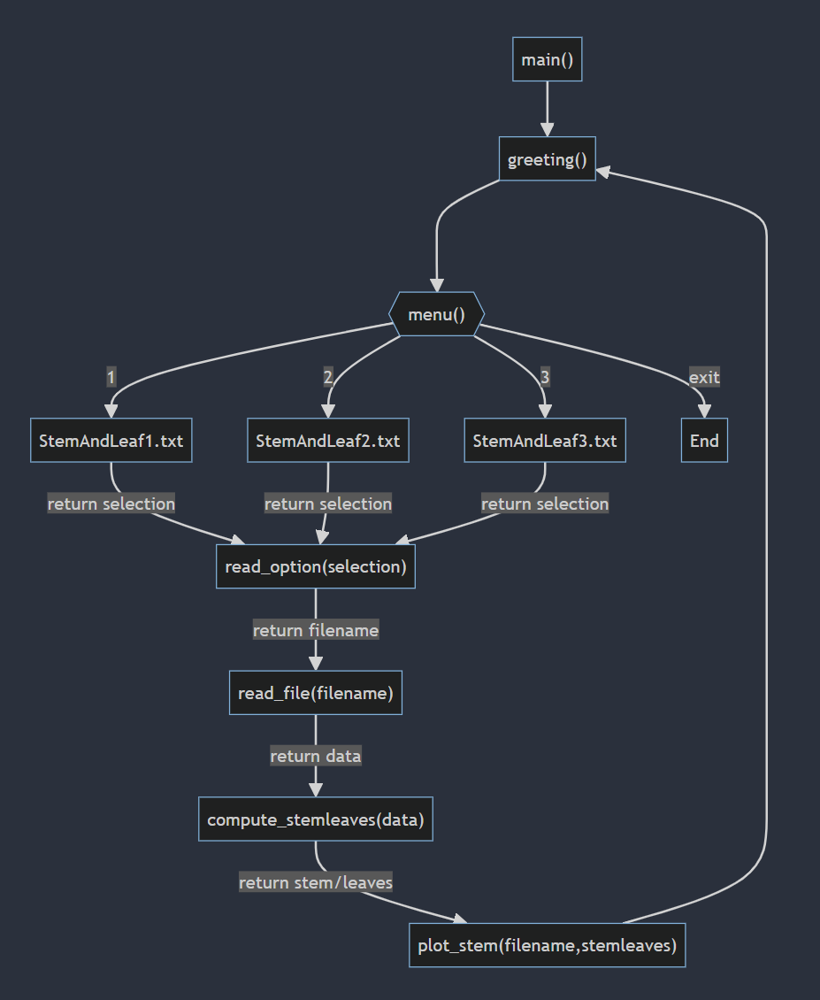

#### Authon: Anthony M. Rodriguez

### Date: 01/24/2024

Git Repo URL: [DSC 430 - https://github.com/Mrmachine3/DPU-DSC430.git](https://github.com/Mrmachine3/DPU-DSC430.git)

Video Explanation URL:

- [Top Down Design Overview of Stem and Leaf Plot - https://youtu.be/owd3rKklN9Y](https://youtu.be/owd3rKklN9Y)

- [Stem and Leaf Plot Demo and Explanation - https://youtu.be/d6g_LhtH374](https://youtu.be/d6g_LhtH374)

**Honor Statement**

I have not given or received any unauthorized assistance on this assignment.

---

## ***Top Down Design of Stem and Leaf Plot***

### Functional Design
**`main()` function**:
This function invokes the top level functions that greet the user, displays a menu, reads menu selection, reads dataset into memory, computes stem and leaf list, and charts the stem and leaf plot.

**`greeting()` function**:
This function simply prints the greeting to the end user.

**`menu()` function**:
This function simply displays menu options available for selection

**`read_option()` function**:
This function evaluates the end-user entry using if-else logic to determine which filename or if program exit option was selected

**`read_file()` function**:
This function is opens the selected file and creates a variable representing a list of stored values in memory for further processing.

**`compute_stemleaves()` function**: 
This function generates a list of all stem and leaf values from the data set read into memory.

**`plot_stem()` function**:
This function displays a text representation of the stem and leaf plot chart

### Design Considerations
- What are the important steps in displaying a stem-and leaf plot?
  - Reading the correct file, parsing dataset into memory, splitting the values of the dataset into stem and leaf pairs to align with original dataset, storing evaluated pairs of values and printing output to the terminal

- How will your main function be organized?
  - The `main()` function represents the initial program that calls all subsequent, helper functions that accomplish each of the important steps included above. Each subsequent call to another helper function passes the results of the previous function to the next function to connect each to the next, as indicated in the image below, specifically, the call to `read_option()`

- How many levels does your design have? Choose one of the lower level functions to describe in more detail.
  - The design has two levels, the first level being the invocation of the `main()` function and the  second level consisting of all the helper functions.

### Implementation Considerations
- How is your main function organized?
  - The `main()` function is organized in a procedural manner whereby the first entrypoint is the `main()` function followed sequentially by the helper functions. For each helper function, the results of the previous functions are passed as parameters to the next function until a stem and leaf plot is printed.

- How does your program automatically determine how many digits the stems and leaves should have?
  - The function called `compute_stemleaves()` includes a variable labeled interval which defines the place value where the leaf should be derived from the stem. This ensures that all values represented in the stem and leaf plot are divisible by 10 and only the ones place values are listed as leaves. In the case of values, with three digits, the interval is used as the divisor to  yield 2 digit stems.

- The data files provided are very “friendly”. How would you design a datafile to confound your program?
  - The files can be made more complicated by having mixed trailing spaces, whitespaces, new lines, or tabs making it more difficult to parse the data. Additionally, the data files may also contain strings, so additional helper functions would be necessary to find and purge string data elements.

- Show the loop(s) were your print out the stem-and-leaf plot and briefly explain how it works.

### Top Down Design Diagram

