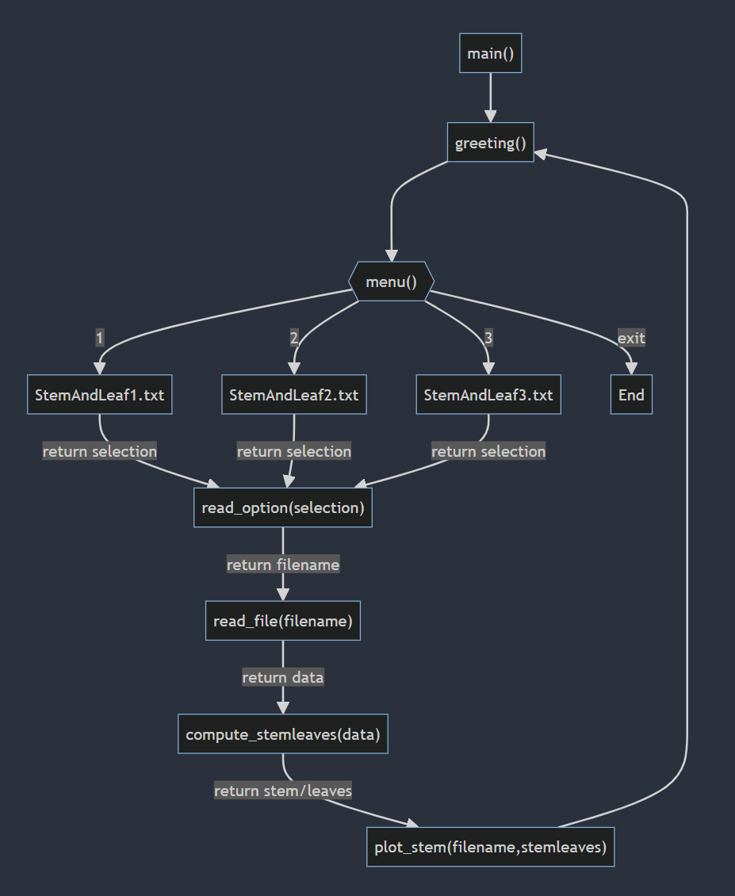

#### Authon: Anthony M. Rodriguez

### Date: 01/24/2024

Git Repo URL: [DSC 430 - https://github.com/Mrmachine3/DPU-DSC430.git](https://github.com/Mrmachine3/DPU-DSC430.git)

Video Explanation URL: 

**Honor Statement**

I have not given or received any unauthorized assistance on this assignment.

---

### ***Top Down Design of Stem and Leaf Plot***

**main() function**:
This function invokes the top level functions that greet the user, displays a menu, reads menu selection, reads dataset into memory, computes stem and leaf list, and charts the stem and leaf plot.

**greeting() function**:
This function simply prints the greeting to the end user.

**menu() function**:
This function simply displays menu options available for selection

**read_option() function**:
This function evaluates the end-user entry using if-else logic to determine which filename or if program exit option was selected

**read_file() function**:
This function is opens the selected file and creates a variable representing a list of stored values in memory for further processing.

**compute_stemleaves() function**: 
This function generates a list of all stem and leaf values from the data set read into memory.

**plot_stem() function**:
This function displays a text representation of the stem and leaf plot chart

